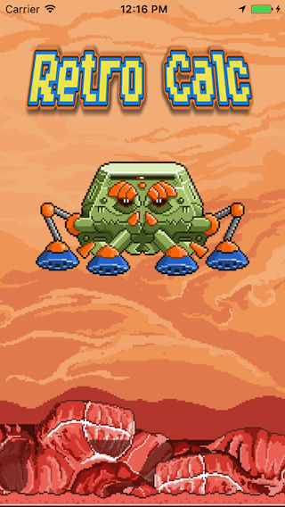
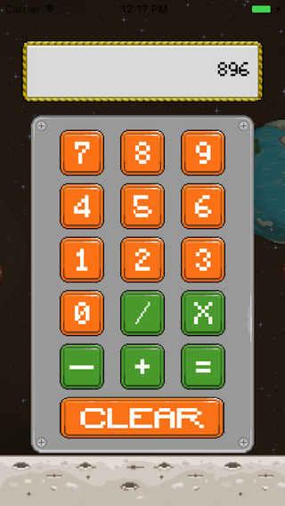

# Retro Calculator

 
## Concepts Learned and/or Practiced:
* UIStackView
* Auto Layout
* Using Custom Fonts in Xcode projects
* Playing Audio Files in Xcode projects with iOS 10
* Practical use of enums
* Using control flow with if-else statements to program app logic
* Error handling with do-catch statements:

  ```
    do {
      try btnSound = AVAudioPlayer(contentsOf: soundURL)
            btnSound.prepareToPlay()
    } catch let err as NSError {
      print(err.debugDescription)
    }
    
  ```
  * The do-statement will attempt to run the code but if it fails, the catch statement will run.
* Creating a launch screen

## Attributions:
**Devslopes iOS 10 & Swift 3: From Beginner to Paid Professional** course on Udemy
